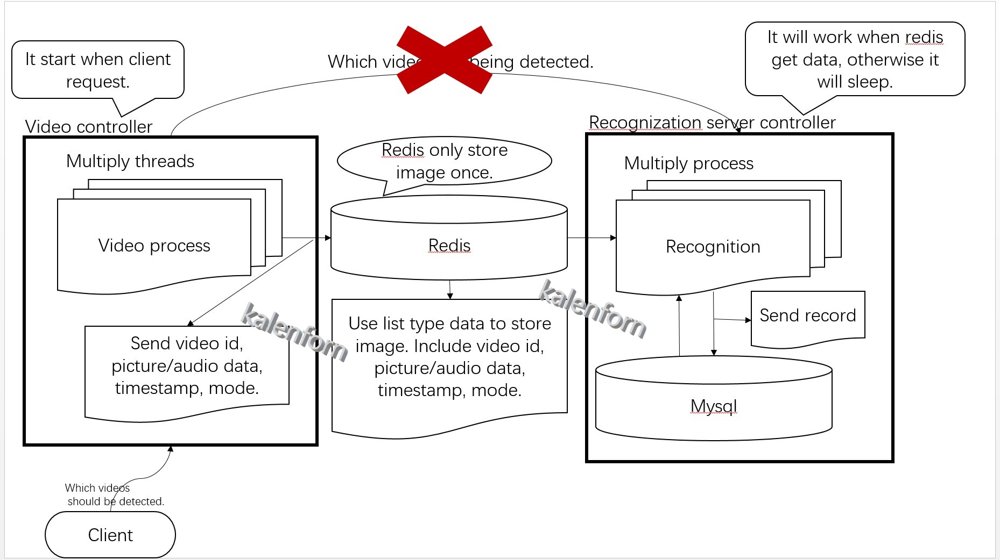
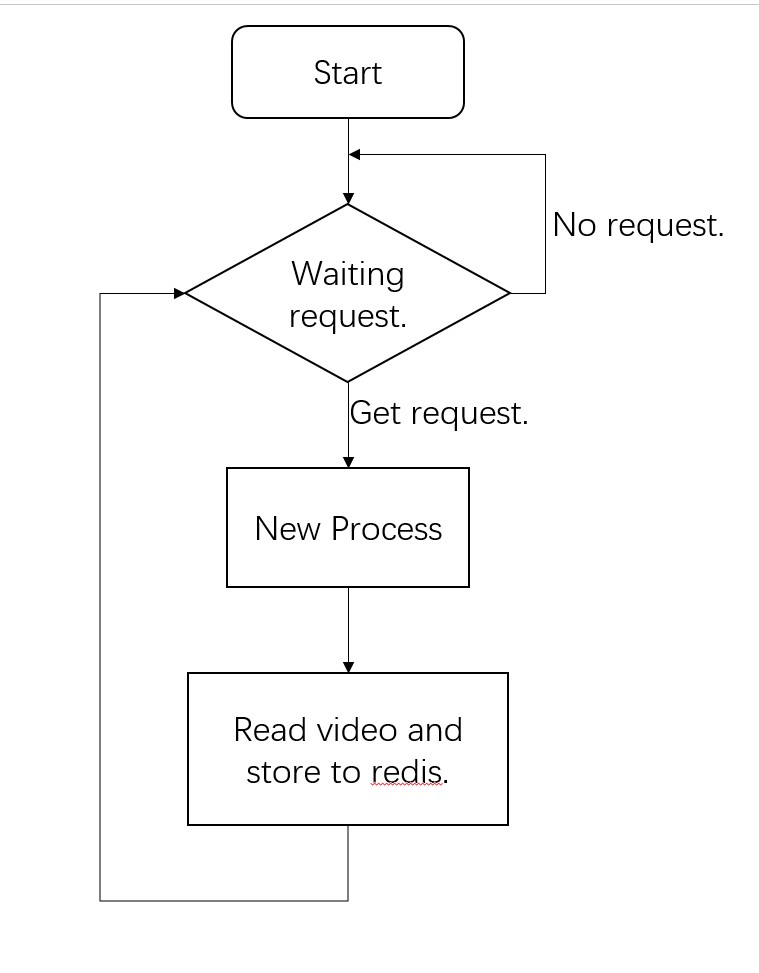
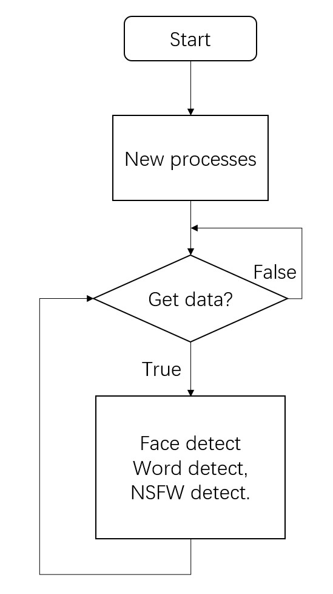
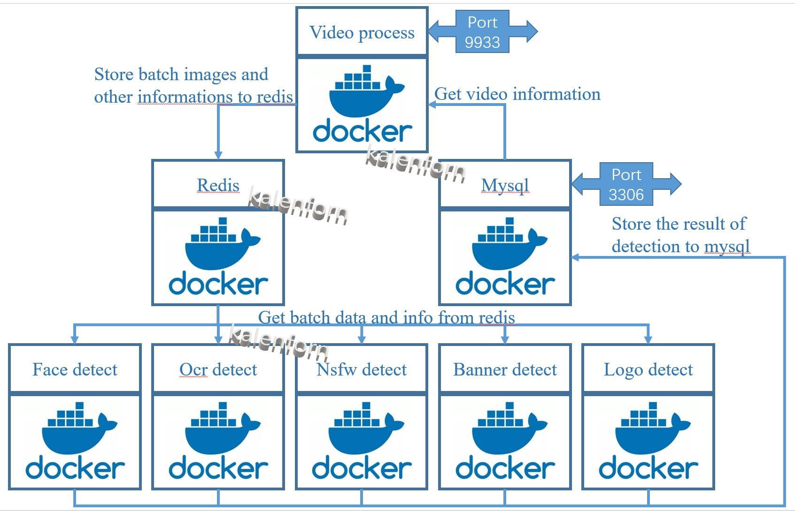

# video-filter-redis

## 目录：
* [目录](#目录)
* [一、项目介绍](#一、项目介绍：)
* [二、环境搭建](#二、环境搭建：)
* [三、使用介绍](#三、使用介绍：)
    + [前提准备](#前提准备：)
    + [数据处理](#数据处理：)
    + [config文件](#config文件：)
    + [开始运行](#开始运行：)
    + [部分测试文件的说明](# 部分测试文件的说明)
* [docker支持](# docker支持)

---
## 一、项目介绍：
本项目的架构如下图：



videoProcess端的逻辑：



recognition端的逻辑：



项目的设计思路是基于分布式处理的方式，首先启动识别进程(recognition controller)，识别进程对redis数据库的某个键值(后续定义为'key_start')进行监听，当key_start中存在数据时recognition controller会从redis数据库获取数据然后处理。

其次启动video controller进程，该进程对客户端进行http监听，客户端需要拥有mysql数据库的视频id记录，客户端通过post请求，发送{'id': [xxx,xxx,xxx]}json数据请求video controller进程进行视频读取处，视频读取完后video controller**不会提供返回值**，所有识别记录将由recognition controller进程记录到mysql数据库中。

在redis数据库中存在*不止一个*key-value，主键值video_filter对仅存放视频的基础信息如:{'video_id': xxx,'timestamp': xxx, 'image_size': xxx等}，有效的图片信息将存在redis数据库的另一个key-value中其中的key是以video_id为 对应关系，所以recognition controller进程将会读两次redis，video controller进程也会存储两次reids， 原因是将numpy数据转换为bytes以后如果将其转为dict方式只存储一次则需要用到json解析二次转换，json转换numpy数组的dict效率太低故而舍弃，改为**松耦合的两步存储方式**，两步存储方式需要使用***异步存储***的***同步读取***方案，而redis的存储方式rpush是以**栈(stack)** 的方式存储，故而使用**读尾**的方式保持两个存储内容同步。

语音识别模块中，recognition controller进程获取到来自redis数据库的mode为audio的消息后会开启一个后台进程，运行语音识别的进程，语音识别进程需要传入一个本地的完整语音路径。

***注意：本项目支持docker版本，并且在docker版本中的操作更简洁，设计理念更贴近并发，详细内容请参考[docker](./docker/README.md)***

***docker 架构图：***



* **项目创新点：**
  
    - [x] 分布式识别视频
    - [x] 资源利用率高
    - [x] 处理使用batch的方式而非传统的单张图片处理
    
* **功能：**
    - [x] 视频的人脸检测
    - [x] 视频中的文字检测
    - [x] 视频中的涉黄检测
    
    所以这个项目有什么功能？答案很明显，这个项目可以实现对视频内容的过滤，满足国内某些需求。
    
* **依赖的第三方：**

    项目所用到的识别模型均为github上开源代码，部分模型为自己训练，请酌情使用
    1. face recognition:
    
        人脸定位的代码来自于facenet-pytorch所提供的mtcnn，项目地址：[mtcnn](https://github.com/timesler/facenet-pytorch/tree/master/models)
    
        人脸识别的代码来自于：[insightface_Pytorch](https://github.com/TreB1eN/InsightFace_Pytorch)
        
    2. text recognition:
       
        ocr检测的代码依赖于：[chineseocr_lite](https://github.com/DayBreak-u/chineseocr_lite)
        
    3. nsfw recognition:
       
        语音检测的代码依赖于:   [nsfw_model](https://github.com/GantMan/nsfw_model)
    
    ***注意，由于本项目不止本人一个人完成，本人能提供的内容全为本人亲自实现，未能提供的部分如docker图中的logo，banner的识别是由本人的朋友实现，但未经他的允许本人不能擅自开源。此项目中的代码除recognition目录中的第三方依赖的代码部分外全由本人完成，在此感谢github社区的朋友给予的帮助！***


## 二、环境搭建：
本项目基于pytorch、redis、mysql等环境，项目运行在ubuntu平台下，环境搭建步骤如下：   
 * **安装mysql：**

    > sudo apt-get update 
    >
    > sudo apt-get install mysql
    
    初始化mysql，请自行记住密码                                 
    > sudo mysql_secure_installation   
    
    开启mysql服务
    
    > sudo service mysql restart 
    
* **安装redis：**

    > sudo apt-get update
    >
    > sudo apt-get install redis-server 

    添加登录密码：
    > sudo vim /etc/redis/redis.conf

    找到如下内容：
    ```
        # IMPORTANT NOTE: starting with Redis 6 "requirepass" is just a compatibility
        # layer on top of the new ACL system. The option effect will be just setting
        # the password for the default user. Clients will still authenticate using
        # AUTH <password> as usually, or more explicitly with AUTH default <password>
        # if they follow the new protocol: both will work.
        #
        requirepass PASSWORD
    ```
    将上述***PASSWORD***替换即可

    重启redis服务

    > sudo service redis-server restart

* **新建conda环境：**

    > conda create -n video-filter-redis python=3.6
    >
    > source activate video-filter-redis
    >
    > pip install -r requirements.txt 

* **CUDA环境说明：**

    >本项目的所有gpu环境都是在cuda11.0的基础上搭建的，cudnn的版本为8，读者请自行搜索cuda环境的安装方式

***以上环境搭建全都是建立在宿主机版本的实现上，若你嫌弃安装这些环境麻烦，请直接使用docker的版本，docker版本只需要搭建docker、nvidia-container环境和显卡驱动环境即可实现[docker](./docker/README.md)***

## 三、使用介绍：

### 前提准备：
mysql数据库准备新建表单：
    
> mysql -u root -p

进入mysql后的操作：                         
> create database video_filter  
>
> use video_filter

新建record表，用于存放记录信息
> create table record (id BIGINT not null auto_increment primary key,
video_id VARCHAR(100) not null,
timestamp VARCHAR(100) not null,
person_name VARCHAR(100) not null,
save_file VARCHAR(255) not null unique,
mode set('face', 'ocr', 'nsfw'));   

新建video表，用于存放id-video对应信息(video_docker表创建方式相同，只用更改名称即可)
> create table video(num BIGINT not null auto_increment primary key,
video_id varchar(1024) not null,
video_path varchar(4096) not null
);  

新建face_feature表，用于存放face feature embedding信息
> create table face_feature (id BIGINT not null auto_increment primary key,
name varchar(1024) not null,
feature varchar(15000) not null
);

### 数据处理：
1. 人脸编码存入数据库：
    > python create_feature.py --image-dir PATH/TO/YOUR/IMAGE/DIR
    
    参数--image-dir为你的需要编码的图片路径，路径中以人名为文件夹，**各文件夹下存放一张只包含单张人脸的图片**
2. 将视频记录存入数据库：

将以下代码复制到文件后将utils/mysqlTools.py文件放在同一个文件夹下，执行即可插入video信息
```
import os
import uuid

from mysqlTools import MysqlHold


mysql = MysqlHold(host='localhost', user='root', password=YOUR MYSQL PASSWORD, database='video_filter', port=3306)

abs_path = os.getcwd()

video_list = os.listdir(YOUR VIDEO DIR)

for item in video_list:

    video_id = uuid.uuid1()
    video_path = os.path.join(abs_path, 'videos', item)
    insert_command = f'insert into video (video_id, video_path) value(\'{video_id}\', \'{video_path}\')'
    print(insert_command)
    mysql.execute_command(insert_command)
    print("[INFO]: Insert, ", item)
```

这里有一份测试数据，在/data/video_test目录下，请读者自行下载使用（考其REAME.md）

### config文件：

项目中使用的config文件为`config/config.cfg`，文件内由对各字段的说明，请读者自行阅读修改

### 开始运行：
1. 首先，你应该先确认机器上的mysql, redis服务是否正确启动，使用`systemctl status mysql.service`, 
    `systemctl status redis-server`查看数据库状态是否正确启动，如若不正确请自行解决

2. 确保config文件中的各device资源是否够用，经本人多次测试结果，单个进程的*face model*占用GPU最大会超过**6G**，
    单个进程的*text model*占用的GPU相对稳定，持续在**2G**，请合理填写config文件中的num_video_process字段。

3. 确保前两步顺利以后，在***两个命令行窗口分别***执行命令:
    > python start_recognize.py
    
    > python start_videoProcess_web.py
    
    此时开启web api服务，此时的服务器将等待客户端请求检测信息。客户端只用请求http://IP/start/即可，但是需要带请求体，请求体为mysql数据库中video表的视频id
    你也可以选择本地测试，此时不执行`python start_videoProcess_web.py`，改为执行`python start_videoProcess.py`

## 部分测试文件的说明

**请参考：[test-doc](./test/README.md)**

# docker支持

**请参考：[docker-doc](./docker/README.md)**

