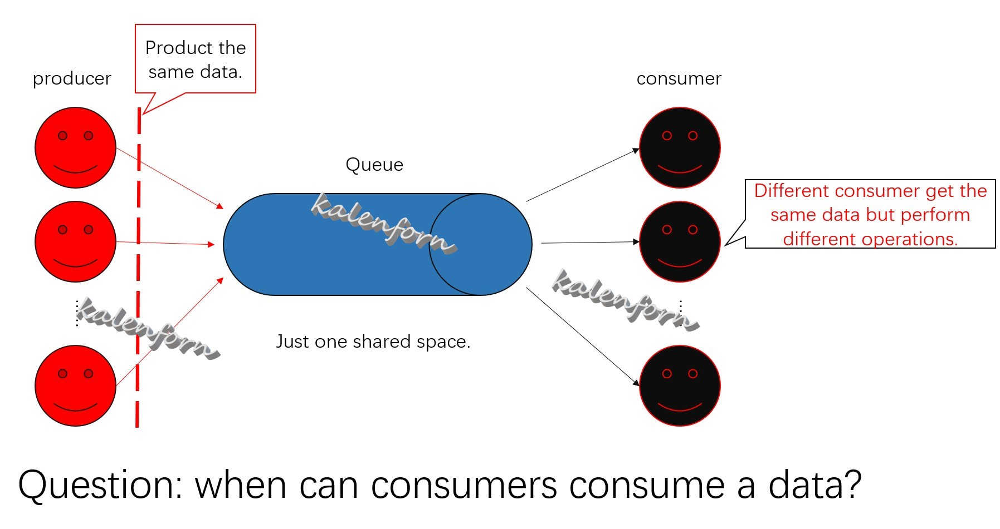
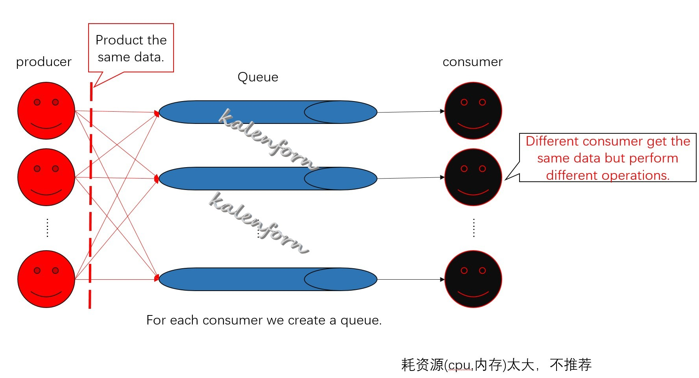
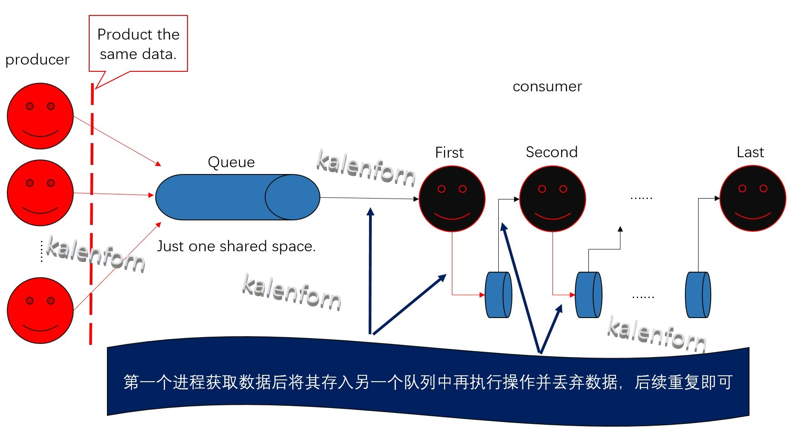
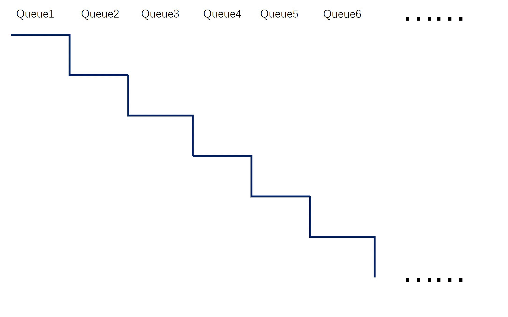

## 问题描述：

~~在多进程（线程）生产者消费者模式的程序中，有多个消费者多个生产者，但是仅有一个共享数据空间，而多个消费者的任务不同（即对共享的相同数据的操作不同），此时会面临一个问题，就是何时将这个共享数据彻底消费掉？也即何时把这个共享数据从共享数据空间中删除掉？~~

**场景：**多生产者生产相同数据，多消费者处理相同数据但是**消费方案不同**，共享数据空间只有一个；消费者—消费者、生产者—消费者之间无直接信息交流。

**问题：**由于消费者**消费方案不同**，导致当消费者获取相同的数据以后由哪个消费者决定数据完全消耗掉（或者数据何时释放）成为问题。

## 解决方案：

### 方案一

采用**计数方式**，对Queue中的每个数据再添加一个字段，当不同的consumer操作过数据以后，将这个字段添加一个consumer操作的**特殊标记**，当Queue中某个数据具有所有consumer的**特殊标记**时即可以删除数据。

这种解决方案对于能**自主控制**的Queue来说实现最简单，操作起来也不麻烦，但这种方案存在一个缺陷，就是对于这个Queue的数据结构的设计相当麻烦，涉及到数据的增删改查，而数据结构中往往很难实现既能很快速查找也能很快修改，所以对数据结构的设计比较繁琐，<u>不建议使用</u>。

计数的方案还可以选择**额外存储**的方式，将计数值存储在**额外**空间，然后所有进程（线程）对共享计数值进行查询，即可实现对数据的消费；这种方式同样存在缺陷，即在对**额外存储**的共享，在某些情况下共享这个值比较繁琐，另一个缺陷是这个方法面临着**异步进程的异步处理**问题，导致这个共享的计数空间大小未知（最坏的情况是数据总长度），共享的计数值查询更为繁琐，所以<u>不推荐使用</u>。

### 方案二

采用牺牲内存的方式来解决，即**增加Queue的个数**，这种方式最为直接，解决方案最为粗暴，实现起来也最为简单。

如图所示，只需要修改代码中生产者的数据存储方式，多几次备份即可实现，但是对于消费者，每个异步消费者需要一个自己的数据存储Queue，所以对于不同的消费进程（线程），需要设置不同的Queue位置。

这种解决方案我将其总结为<u>**平行赛道方案**</u>，在内存无限制的时候可随意使用，这也就说明了这个方案的缺陷，内存使用特别快，因为他的存储占用是普通方法的n（n为异步消费者个数）倍。

### 方案三

计算机组成原理里有一种叫做***流水线***的处理思想，但是这种方案处理的是同步问题，不过这些同步问题却是可以异步进行的所以***流水线***的处理思想很适合这个问题。

问题分析：<u>**多进程下的多生产者多消费者（消费者消费相同数据但处理不同）模式，消费者何时彻底消费数据**</u>。

这种情况下可以将异步的多消费者看作是一个伪同步进程（consumer1-->consumer2-->consumer3-->......->consumern），此时，消费者使用的同一数据仅在第n个（最后）状态需要丢弃，而当第n个（最后）状态处理第1个数据时，前n-1个状态是不需要保存第1个数据的，因为此时在流水线的处理过程中，**第n个（最后）状态前的所有状态都已经对第1个数据操作完成了**。

上述分析中可以看出来，我们仅需要将consumeri数据读取空间中处理过后的数据转存到consumer(i+1)的读取空间中，并在consumeri的数据读取空间中删除已经处理的数据即可；**这种方法在任意时间点整个存储空间中仅有一份数据，没有冗余数据，数据是流动在不同的存储位置的**，这种方案就很像流水线，所以我称之为流水线方案。

上图可以看到，这种方式看似也需要分配n个存储空间，但实际上你只需要将原始的Queue切分为n（n为消费者数量）段，为每个消费者分配一段存储即可，因为从整个数据存储的角度观察，数据只有一份，所以不需要再另外开辟存储空间。

这种方式的缺陷是处理有些许时延，因为当所有**异步消费者**处理**数据流水线**上时难免会成为伪同步的过程，但是这个伪同步过程的代价相对来说可以接受，所以推荐使用。

与上述两种方法的比较：

对比于方案二，**方案三的程序开销比其小n倍**，但是在消费者程序的**数据处理部分相对复杂一些**，多了对数据的读取后再插入的操作。

对比于方案一，**方案三的数据处理方式比其简单多了**，但是对于**共享空间的利用率却没有方案一高**，因为方案三中的生产着永远都无法获取全部的共享空间，有一部分一定要被生产者占用。

**总结：**

+ 优点：
  + 方案一的共享空间利用率最高
  + 方案二的运行速度最快，代码最简单
  + 方案三节约总的内存空间，代码复杂度不算特别大，速度不算特别慢

+ 缺点：
  + 方案一的代码最复杂，实现起来最难
  + 方案二的内存占用最大
  + 方案三的缺点需要对流水线上的进程（线程）顺序安排合理，否则会造成异步进程变为同步进程；对进程编排极为繁琐

数据流动的过程如下：

这里的每一排表示的是当data1正在被处理的时候，其他Queue中至少存在的数据，即异步进程（线程)i处理data1时，前面的进程（线程)i - 1至少在处理data2甚至data3等的数据，上图显示了流水线的过程。

**为解决方案三的进程编排问题**，可采用方案二方案三结合的放法来解决，即增加**部分额外存储**空间然后进行**多条流水线**。

## 总结：

综上所述，方案三的优点与其他相比较强，但存在着编排麻烦的问题，如果在硬件资源不允许的条件且不想大型修改代码的情况下可以考虑**流水线+平行赛道方案**的方式解决**多进程下的多生产者多消费者（消费者消费相同数据但处理不同）模式**的数据消费问题。总的来说各解决方案均有优缺点，都不是完美的解决方案。

